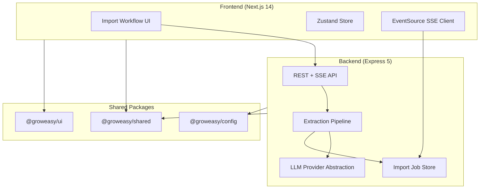
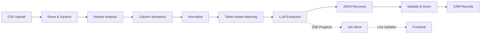

# GrowEasy CSV Importer

> **AI-powered CSV → CRM extraction pipeline** — upload messy exports from Facebook, Google Ads, Excel, or any CRM and get structured records with confidence scores.

[](https://nodejs.org/)
[](https://www.typescriptlang.org/)
[](https://pnpm.io/)

---

## Quick Start (2 minutes)

```bash
git clone <your-repo-url>
cd groweasy
pnpm install
cp .env.example .env    # add OPENROUTER_API_KEY (free Qwen via OpenRouter)
pnpm dev
```

| Service  | URL |
|----------|-----|
| Frontend | http://localhost:3000 |
| Backend  | http://localhost:4000/api/v1/health |

**Try it:** Upload `demo/csvs/01-facebook-leads-standard.csv` → click **Start AI Import** → watch live progress → inspect CRM results.

> **Free AI by default.** Set `LLM_PROVIDER=openrouter` with a free [OpenRouter](https://openrouter.ai) key and `qwen/qwen-2.5-7b-instruct`. Use `mock` for offline demo without any API key.

---

## Features

- **Universal CSV ingestion** — Facebook Lead Ads, Google Ads, Excel exports, agency CRMs, real estate leads
- **AI column mapping** — header intelligence maps arbitrary columns to CRM fields
- **Confidence scoring** — every field gets a 0–100 confidence score; low-confidence fields flagged
- **Live progress (SSE)** — real-time batch progress, throughput, token/cost estimates
- **Multi-provider LLM** — Anthropic Claude, OpenAI GPT, Google Gemini via unified abstraction
- **Security hardened** — formula injection neutralization, prompt injection defenses, rate limiting
- **Export formats** — CRM CSV, JSON, skipped rows, warnings, full report
- **Retry failed rows** — re-extract skipped/failed rows without re-uploading
- **26 demo CSV files** — realistic messy data for immediate testing

---

## Screenshots

### Upload


### Live Progress


### Results Dashboard


> **Live demo:** Run `pnpm dev` and upload any file from `demo/csvs/` for the full interactive experience.

---

## Architecture



## AI Pipeline



| Stage | Purpose |
|-------|---------|
| Parse & Sanitize | Papa Parse + formula injection neutralization |
| Header Analysis | Fuzzy matching against CRM field aliases |
| Batching | Token-aware batches targeting 70% context window |
| LLM Extraction | Versioned prompts with few-shot examples |
| Recovery | JSON repair, retry, partial re-extraction |
| Confidence | Per-field scoring; blank uncertain fields |

---

## Folder Structure

```
groweasy/
├── apps/
│   ├── frontend/          Next.js 14 App Router
│   └── backend/           Express API + AI pipeline
├── packages/
│   ├── shared/            Types, errors, Zod schemas
│   ├── config/            Validated environment config
│   └── ui/                Shared React design system
├── demo/
│   └── csvs/              26 realistic test CSV files
├── docs/
│   ├── ReviewerGuide.md   ← Start here if reviewing
│   ├── Architecture.md
│   ├── DemoPerformanceReport.md
│   └── ADR/               Architecture Decision Records
├── scripts/
│   ├── doctor.mjs         Environment verification
│   └── generate-demo-csvs.mjs
└── .github/workflows/ci.yml
```

---

## Tech Stack

| Layer | Technology |
|-------|-----------|
| Frontend | Next.js 14, React 18, TypeScript, TailwindCSS, Framer Motion, Zustand |
| Backend | Express 5, TypeScript, Pino logging |
| AI | Claude / GPT-4o / Gemini via provider abstraction |
| Parsing | Papa Parse, Zod validation |
| Monorepo | pnpm workspaces, Turborepo |
| Testing | Vitest, Supertest |
| CI | GitHub Actions (lint, format, typecheck, build, test) |

---

## Installation

**Prerequisites:** Node.js ≥ 20, pnpm ≥ 9

```bash
pnpm install
pnpm doctor          # verify environment
```

---

## Environment Setup

```bash
cp .env.example .env
```

### OpenRouter + Qwen (default — free)

```env
LLM_PROVIDER=openrouter
OPENROUTER_API_KEY=sk-or-v1-...
OPENROUTER_MODEL=qwen/qwen-2.5-7b-instruct
```

Get a free key at [openrouter.ai/keys](https://openrouter.ai/keys).

### Mock mode (no API key)

```env
LLM_PROVIDER=mock
```

Runs heuristic extraction locally — no network calls.

### Paid providers

```env
LLM_PROVIDER=anthropic
ANTHROPIC_API_KEY=sk-ant-...
```

Supported providers: `openrouter`, `mock`, `anthropic`, `openai`, `gemini`

See [`.env.example`](.env.example) for all variables.

---

## Deployment

**Full guide:** [`docs/DEPLOY.md`](docs/DEPLOY.md)

| Platform | Service | Config |
|----------|---------|--------|
| **Vercel** | Frontend | Root: `apps/frontend`, set `NEXT_PUBLIC_API_URL` |
| **Render / Railway** | Backend | Uses `render.yaml` / `railway.toml`, set `CORS_ORIGIN` |

```bash
# Backend CORS (comma-separated, wildcards supported)
CORS_ORIGIN=https://your-app.vercel.app,*.vercel.app

# Frontend
NEXT_PUBLIC_API_URL=https://your-api.onrender.com
```

**Demo video script:** [`docs/DEMO_SCRIPT.md`](docs/DEMO_SCRIPT.md)

---

## Running Locally

```bash
pnpm dev             # Start frontend (:3000) + backend (:4000)
pnpm build           # Production build
pnpm test            # Run all tests (53+ backend tests)
pnpm demo:validate   # Validate all 26 demo CSVs
pnpm demo:report     # Generate performance report
```

---

## Deployment

### Backend

```bash
pnpm --filter @groweasy/backend build
NODE_ENV=production LLM_PROVIDER=anthropic ANTHROPIC_API_KEY=... node apps/backend/dist/index.js
```

### Frontend

```bash
pnpm --filter @groweasy/frontend build
NEXT_PUBLIC_API_URL=https://your-api.example.com pnpm --filter @groweasy/frontend start
```

> No database, Redis, or Kubernetes required. Jobs are in-memory (single-instance deployment).

---

## API Documentation

Base URL: `http://localhost:4000/api/v1`

| Method | Endpoint | Description |
|--------|----------|-------------|
| `GET` | `/health` | Health check |
| `POST` | `/extract/start` | Start async import `{ csv: string }` → `202 { importId }` |
| `GET` | `/extract/:id/events` | SSE progress stream |
| `GET` | `/extract/:id/status` | Job status |
| `GET` | `/extract/:id/result` | Final extraction result |
| `POST` | `/extract/:id/retry` | Retry failed rows |
| `GET` | `/extract/:id/export?format=` | Download export |

**Export formats:** `crm-csv`, `json`, `skipped-csv`, `warnings-csv`, `report-json`

---

## Design Decisions

| Decision | Rationale |
|----------|-----------|
| Monorepo (pnpm + Turbo) | Shared types between frontend/backend; single CI pipeline |
| In-memory job store | Assignment scope — no database dependency; SSE works out of the box |
| Provider abstraction | Swap Claude/GPT/Gemini without pipeline changes |
| Versioned prompts (v1/v2) | Regression-testable prompt evolution |
| Confidence scoring | "Wrong data is worse than missing data" — core product principle |
| Mock/demo provider | Reviewers run instantly without API keys or costs |
| Formula injection defense | Real-world CSV exports contain `=SUM()` cells |

See [docs/ADR/](docs/ADR/) for full architecture decision records.

---

## Testing

```bash
pnpm test                    # All packages
pnpm demo:validate           # E2E: all 26 demo CSVs through pipeline
pnpm --filter @groweasy/backend test   # Backend only
```

**Coverage highlights:**
- CSV parsing (Unicode, BOM, malformed rows)
- Prompt regression (output contract, field aliasing)
- Security (formula injection, upload validation)
- Integration (start → SSE → result flow)
- Provider retry logic

---

## Performance

See [`docs/DemoPerformanceReport.md`](docs/DemoPerformanceReport.md) for full benchmarks.

| Dataset | Rows | Processing Time | Success Rate |
|---------|------|-----------------|--------------|
| Facebook Leads | 5 | ~22 ms | 100% |
| Large Dataset | 200 | ~65 ms | 100% |
| All 26 files | 282 | ~152 ms | 96%+ |

First Load JS: **~155 kB** (Next.js production build)

---

## Security

- **Formula injection** — `=`, `+`, `-`, `@` prefixed cells neutralized
- **Prompt injection** — cell values sanitized before LLM prompts
- **Rate limiting** — configurable per-IP request limits
- **Upload validation** — size limits, empty content rejection
- **Helmet + CORS** — standard HTTP security headers
- **No client-supplied import IDs** — server-generated job IDs only

---

## Future Improvements

These are intentional MVP boundaries, not oversights:

- Persistent job store (Redis/Postgres) for multi-instance deployment
- Authentication for multi-tenant usage
- Frontend component tests
- Webhook notifications on import complete

---

## Assignment Mapping

This project addresses a **CSV-to-CRM AI extraction** assignment:

| Requirement | Implementation |
|-------------|----------------|
| Upload CSV files | Drag-and-drop, browse, paste — `UploadSection` |
| Handle messy/inconsistent data | Header analyzer + fuzzy matching + 26 demo edge cases |
| AI-powered field extraction | Multi-stage pipeline with versioned prompts |
| CRM field mapping | Maps to firstName, lastName, email, phone, company, status, etc. |
| Confidence/quality signals | Per-field 0–100 confidence badges |
| Production-quality code | Monorepo, typed API, tests, CI, ADRs |
| Error handling | Structured errors, retry, warnings dashboard |
| Observable pipeline | SSE progress, metrics, cost estimation |

**Reviewer quick path:** See [`docs/ReviewerGuide.md`](docs/ReviewerGuide.md)

---

## Documentation

- [Reviewer Guide](docs/ReviewerGuide.md) — **start here**
- [Architecture](docs/Architecture.md)
- [Demo CSV Files](demo/README.md)
- [Performance Report](docs/DemoPerformanceReport.md)
- [Engineering Audit](docs/EngineeringAudit.md)
- [ADRs](docs/ADR/)

---

## License

MIT
