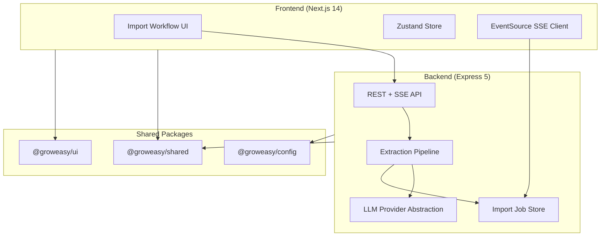
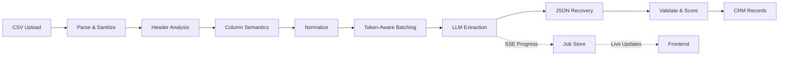

# GrowEasy Import

> Upload any messy CSV lead export → AI maps columns → structured CRM records with confidence scores.

**GrowEasy Software Developer Intern assignment submission** · [Live Demo](https://groweasy-csv-importer-frontend-two.vercel.app) · [Reviewer Guide](docs/ReviewerGuide.md)

[](https://groweasy-csv-importer-frontend-two.vercel.app)
[](https://github.com/shriansh1625/groweasy-csv-importer)
[](https://nodejs.org/)
[](https://www.typescriptlang.org/)
[](./docs/ASSIGNMENT.md)
[](./docker-compose.yml)

---

## Live Demo

| | URL |
|---|-----|
| **Application** | https://groweasy-csv-importer-frontend-two.vercel.app |
| **API (health)** | https://groweasy-api-7o82.onrender.com/api/v1/health |
| **Source code** | https://github.com/shriansh1625/groweasy-csv-importer |

**2-minute test:** Upload [`demo/csvs/01-facebook-leads-standard.csv`](demo/csvs/01-facebook-leads-standard.csv) → review column mapping → **Confirm import** → 5 CRM records with confidence badges.

> First request after idle may take ~30s (Render free tier cold start). Refresh if the API shows offline.

---

## Table of Contents

- [Overview](#overview)
- [How It Works](#how-it-works)
- [Quick Start](#quick-start-2-minutes)
- [Features](#features)
- [Screenshots](#screenshots)
- [Architecture](#architecture)
- [Tech Stack](#tech-stack)
- [Environment Setup](#environment-setup)
- [Deployment](#deployment)
- [Docker](#docker)
- [API Reference](#api-reference)
- [Testing](#testing)
- [Assignment Mapping](#assignment-mapping)
- [Documentation](#documentation)

---

## Overview

Marketing teams export leads from Facebook, Google Ads, Excel, and dozens of CRMs — each with different column names, typos, and formats. GrowEasy Import accepts **any CSV**, uses AI to understand column semantics, extracts normalized CRM fields, and surfaces **per-field confidence scores** so bad data is visible before it enters a CRM.

Built as a production-quality monorepo: typed API contracts, SSE progress streaming, multi-provider LLM abstraction, security hardening, Docker, CI, and 100+ tests.

---

## How It Works

```
Upload CSV → Analyze headers → Preview column mapping → Confirm import
    → AI batch extraction (SSE progress) → CRM results + confidence scores → Export
```

1. **Upload** — drag-and-drop, file browse, or paste CSV text
2. **Analyze** — server detects delimiter, maps headers to CRM fields (`Email`, `Phone`, `Company`, …)
3. **Preview** — column mapping badges show AI confidence before any extraction runs
4. **Extract** — token-aware batched LLM calls with live progress (batch, throughput, tokens)
5. **Review** — sortable CRM grid, per-field confidence, warnings for low-confidence values
6. **Export** — CRM CSV, JSON, skipped rows, warnings report

**Messy data demo:** [`demo/csvs/08-broken-headers-typos.csv`](demo/csvs/08-broken-headers-typos.csv) — headers like `Nmae`, `Emial`, `Phne` are mapped correctly.

---

## Quick Start (2 minutes)

```bash
git clone https://github.com/shriansh1625/groweasy-csv-importer.git
cd groweasy-csv-importer
pnpm install
cp .env.example .env    # add OPENROUTER_API_KEY for free Qwen via OpenRouter
pnpm dev
```

| Service  | URL |
|----------|-----|
| Frontend | http://localhost:3000 |
| Backend  | http://localhost:4000/api/v1/health |

**No API key?** Set `LLM_PROVIDER=mock` in `.env` for offline heuristic extraction.

---

## Features

| Category | Details |
|----------|---------|
| **Ingestion** | Facebook Lead Ads, Google Ads, Excel, agency CRMs, real estate exports |
| **Intelligence** | Delimiter detection (comma/tab/semicolon), fuzzy header matching, typo tolerance |
| **AI extraction** | Multi-stage pipeline with versioned prompts and JSON recovery |
| **Confidence** | 0–100 score per field; low-confidence values flagged, not silently guessed |
| **Progress** | SSE live updates with polling fallback; batch throughput and token metrics |
| **LLM providers** | OpenRouter (Qwen), Anthropic, OpenAI, Gemini, mock — swappable via env |
| **Security** | Formula injection neutralization, prompt injection defenses, rate limiting |
| **Export** | CRM CSV, JSON, skipped rows, warnings CSV, full report JSON |
| **Retry** | Re-extract failed/skipped rows without re-uploading the file |
| **Demo data** | 37 CSV files covering edge cases in [`demo/csvs/`](demo/csvs/) |

---

## Screenshots

### Upload


### Live Progress


### Results Dashboard


---

## Architecture



### AI Pipeline



| Stage | Purpose |
|-------|---------|
| Parse & Sanitize | Papa Parse + formula injection neutralization |
| Header Analysis | Fuzzy matching against CRM field aliases |
| Batching | Token-aware batches targeting 70% context window |
| LLM Extraction | Versioned prompts with few-shot examples |
| Recovery | JSON repair, retry, partial re-extraction |
| Confidence | Per-field scoring; blank uncertain fields |

### Folder Structure

```
groweasy-csv-importer/
├── apps/
│   ├── frontend/          Next.js 14 App Router
│   └── backend/           Express API + AI pipeline
├── packages/
│   ├── shared/            Types, errors, Zod schemas
│   ├── config/            Validated environment config
│   └── ui/                Shared React design system
├── demo/csvs/             37 realistic test CSV files
├── docs/                  Reviewer guide, architecture, ADRs
├── docker-compose.yml
└── .github/workflows/ci.yml
```

---

## Tech Stack

| Layer | Technology |
|-------|-----------|
| Frontend | Next.js 14, React 18, TypeScript, Tailwind CSS, Framer Motion, Zustand |
| Backend | Express 5, TypeScript, Pino logging |
| AI (production) | OpenRouter — `qwen/qwen-2.5-7b-instruct` |
| AI (dev/alternatives) | Anthropic Claude, OpenAI GPT-4o, Google Gemini, mock |
| Parsing | Papa Parse, Zod validation |
| Monorepo | pnpm workspaces, Turborepo |
| Testing | Vitest, Supertest |
| CI | GitHub Actions — lint, format, typecheck, build, test |
| Deploy | Vercel (frontend), Render (backend) |

---

## Environment Setup

```bash
cp .env.example .env
```

### OpenRouter + Qwen (recommended — free tier)

```env
LLM_PROVIDER=openrouter
OPENROUTER_API_KEY=sk-or-v1-...
OPENROUTER_MODEL=qwen/qwen-2.5-7b-instruct
```

Get a key at [openrouter.ai/keys](https://openrouter.ai/keys).

### Mock mode (no API key)

```env
LLM_PROVIDER=mock
```

Supported providers: `openrouter`, `mock`, `anthropic`, `openai`, `gemini` — see [`.env.example`](.env.example).

---

## Deployment

**Production (this submission):**

| Service | Platform | URL |
|---------|----------|-----|
| Frontend | Vercel | https://groweasy-csv-importer-frontend-two.vercel.app |
| Backend | Render | https://groweasy-api-7o82.onrender.com |

**Deploy your own:** [`docs/DEPLOY.md`](docs/DEPLOY.md)

```env
# Backend
CORS_ORIGIN=https://your-app.vercel.app,*.vercel.app

# Frontend
NEXT_PUBLIC_API_URL=https://your-api.onrender.com
```

Blueprint: [`render.yaml`](render.yaml) · Frontend config: [`apps/frontend/vercel.json`](apps/frontend/vercel.json)

---

## Docker

```bash
cp .env.example .env
docker compose up --build
```

| Service | URL |
|---------|-----|
| Frontend | http://localhost:3000 |
| Backend | http://localhost:4000/api/v1/health |

---

## API Reference

Base URL: `http://localhost:4000/api/v1` (production: `https://groweasy-api-7o82.onrender.com/api/v1`)

| Method | Endpoint | Description |
|--------|----------|-------------|
| `GET` | `/health` | Health check |
| `POST` | `/extract/analyze` | Preview column mapping `{ csv: string }` |
| `POST` | `/extract/start` | Start async import `{ csv: string }` → `202 { importId }` |
| `GET` | `/extract/:id/events` | SSE progress stream |
| `GET` | `/extract/:id/status` | Job status (polling fallback) |
| `GET` | `/extract/:id/result` | Final extraction result |
| `POST` | `/extract/:id/retry` | Retry failed rows |
| `GET` | `/extract/:id/export?format=` | Download export |

**Export formats:** `crm-csv`, `json`, `skipped-csv`, `warnings-csv`, `report-json`

---

## Testing

```bash
pnpm test                    # All packages (100+ tests)
pnpm demo:validate           # Validate demo CSVs through pipeline
pnpm --filter @groweasy/backend test
pnpm doctor                  # Verify local environment
```

**Coverage highlights:** CSV parsing (Unicode, BOM, delimiters), prompt regression, security (formula injection), SSE integration flow, provider retry logic.

---

## Design Decisions

| Decision | Rationale |
|----------|-----------|
| Monorepo (pnpm + Turbo) | Shared types between frontend/backend; single CI pipeline |
| In-memory job store | No database dependency for assignment scope; SSE works out of the box |
| Provider abstraction | Swap LLM providers without pipeline changes |
| Versioned prompts | Regression-testable prompt evolution |
| Confidence scoring | Wrong data is worse than missing data |
| Analyze-before-import | Reviewers see column mapping before LLM cost is spent |
| Formula injection defense | Real-world CSV exports contain `=SUM()` cells |

See [`docs/ADR/`](docs/ADR/) for architecture decision records.

---

## Security

- **Formula injection** — `=`, `+`, `-`, `@` prefixed cells neutralized
- **Prompt injection** — cell values sanitized before LLM prompts
- **Rate limiting** — configurable per-IP request limits
- **Upload validation** — size limits, empty content rejection
- **Helmet + CORS** — standard HTTP security headers

---

## Assignment Mapping

| Requirement | Implementation |
|-------------|----------------|
| Upload CSV files | Drag-and-drop, browse, paste — `UploadSection` |
| Handle messy/inconsistent data | Header analyzer + fuzzy matching + 37 demo edge cases |
| AI-powered field extraction | Multi-stage pipeline with versioned prompts |
| CRM field mapping | firstName, lastName, email, phone, company, status, etc. |
| Confidence/quality signals | Per-field 0–100 confidence badges |
| Production-quality code | Monorepo, typed API, tests, CI, Docker, ADRs |
| Error handling | Structured errors, retry, warnings dashboard |
| Observable pipeline | SSE progress, metrics, cost estimation |

Full rubric mapping: [`docs/ASSIGNMENT.md`](docs/ASSIGNMENT.md)

---

## Documentation

| Doc | Purpose |
|-----|---------|
| [`docs/ReviewerGuide.md`](docs/ReviewerGuide.md) | **Start here** — 2-minute evaluation path |
| [`docs/ASSIGNMENT.md`](docs/ASSIGNMENT.md) | Rubric criteria → code mapping |
| [`docs/SUBMISSION.md`](docs/SUBMISSION.md) | Submission checklist |
| [`docs/DEPLOY.md`](docs/DEPLOY.md) | Vercel + Render deployment |
| [`docs/Architecture.md`](docs/Architecture.md) | System design deep dive |
| [`demo/README.md`](demo/README.md) | Demo CSV catalog |
| [`docs/ADR/`](docs/ADR/) | Architecture decision records |

---

## License

MIT
